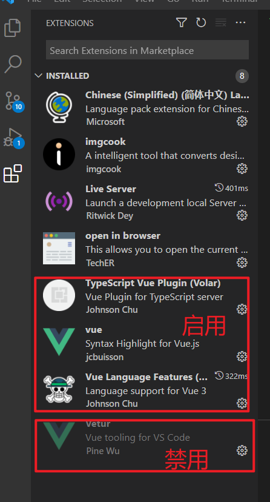
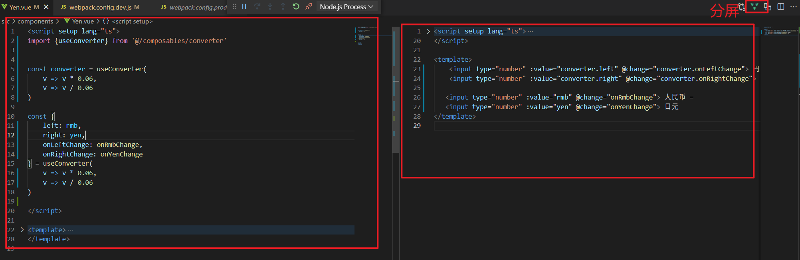
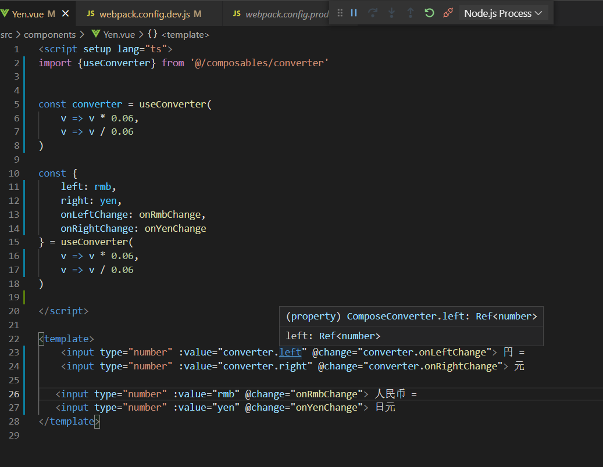
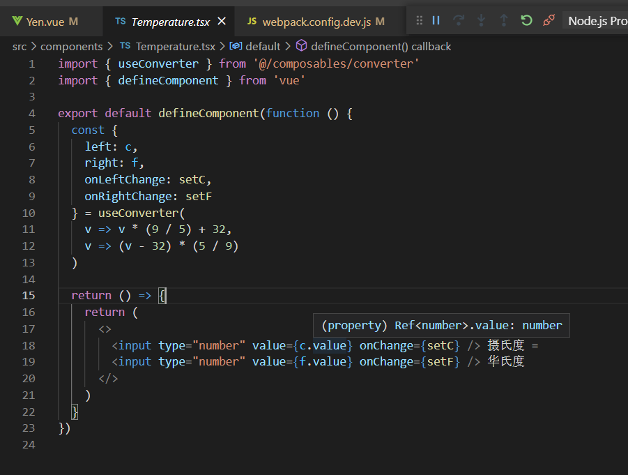

# vue3-playground

```bash
npm install
npm run serve
```

### environment

node version ">= 14.0.0"

下载地址: https://repo.huaweicloud.com/nodejs/latest-v14.x/

---

### quick start

1.安装vscode拓展，启用volor，禁用vetur



2.两种写法



3.代码提示效果，支持click跳转


